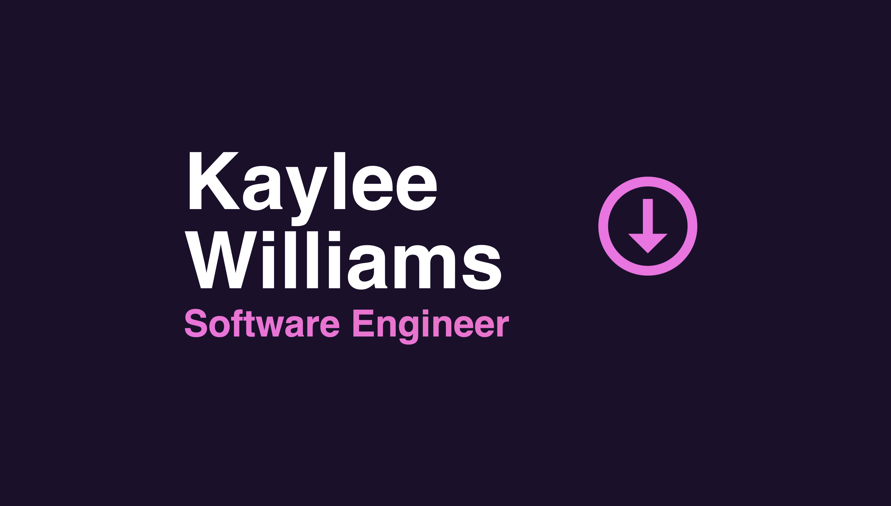

<div align="center">
<h1>Portfolio v3</h1>

<a href="https://www.kayleewilliams.dev" target="_blank">
    https://www.kayleewilliams.dev
</a>

<p> The third version of my personal portfolio to showcase my projects. <br/> Built with Nuxt 3 & Tailwind CSS.</p>


</div>


## Installation
1. Navigate to the portfolio folder.
2. Install the dependencies.
  ```npm install```
3. Start the development server.
  ```npm run dev```
4. View it at [http://localhost:3000](http://localhost:3000)

